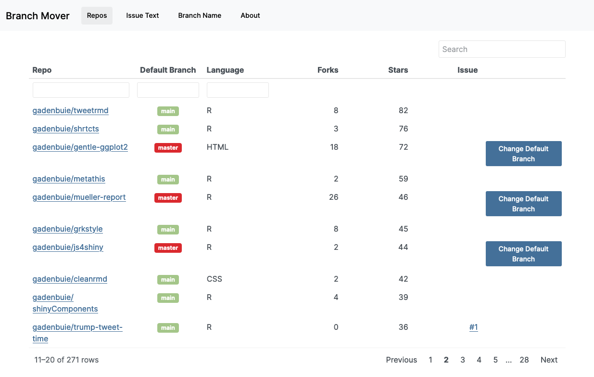

<!-- README.md is generated from README.Rmd. Please edit that file -->

# branchMover

<!-- badges: start -->
<!-- badges: end -->

Change the default branch of your GitHub repositories, from inside
RStudio.

## Installation

You can install the development version of branchMover from
[GitHub](https://github.com/) with:

``` r
# install.packages("devtools")
devtools::install_github("gadenbuie/branchMover")
```

The app uses the [usethis](https://usethis.r-lib.org) and
[gh](https://gh.r-lib.org) packages. You need to configure gh with a
Personal Access Token to be able to authenticate with the GitHub API.
Read more about setting up a PAT in one of these places:

-   [Managing Git(Hub)
    Credentials](https://usethis.r-lib.org/articles/articles/git-credentials.html)
    *usethis article*
-   [Personal access token for
    HTTPS](https://happygitwithr.com/https-pat.html) *guidance form
    [Happy Git and GitHub for the useR](https://happygitwithr.com)*
-   [Managing Personal Access
    Tokens](https://gh.r-lib.org/articles/managing-personal-access-tokens.html)
    *gh article*

Then, in RStudio, run the app with:

``` r
branchMover::app()
```



If you’d like to explore or reconfigure the default branch of
repositories that you manage in other organizations, provide `app()`
with the user or organization name. Branch Mover will tell you how many
repos you have access to in the organization and it won’t let you update
branch names for repos where you don’t have admin permissions.

``` r
branchMover::app("rstudio-education")
#> ℹ @rstudio-education has 57 total repositories (including forks)
#> • 57 public repos
#> • 0 private repos
#> ℹ 57 non-fork repositories have the following default branches:
#> x master: 51 repos
#> ✓ main: 6 repos
#> ℹ You have admin rights on 1 repo
```

## Notes

branchMover changes the default branch on GitHub and creates an issue
announcing the change. If everything works, the issue is closed and
instructions on how to update local copies of the repo are added to the
issue.

Unfortunately, branchMover *doesn’t* update the default branch in *your*
local copies of your repos. Thankfully, this is relatively pain-free
with the
[usethis::git_default_branch_rediscover()](https://usethis.r-lib.org/reference/git-default-branch.html)
function, added in usethis version 2.1.2.

The tidyverse article [Renaming the default
branch](https://www.tidyverse.org/blog/2021/10/renaming-default-branch/)
by Jenny Bryan provides a lot more detail about what’s going on behind
the scenes.
